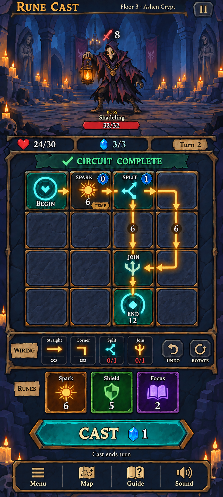
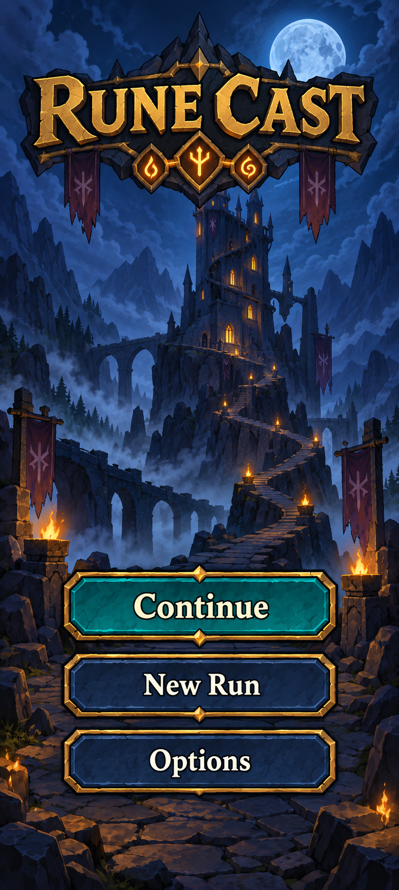
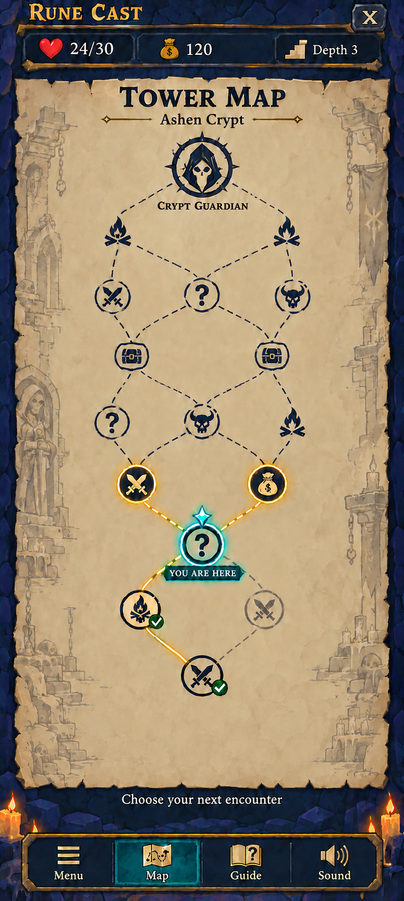
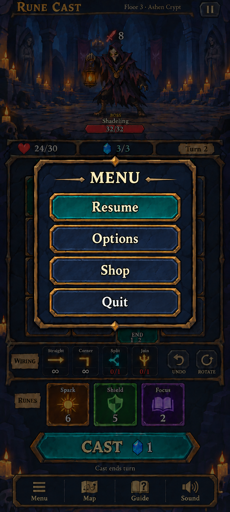

# Rune Cast visual reference

The user approved the following four attached images as the final visual references on October 8, 2026. Exact copies are preserved in `output/imagegen/approved/`. These take precedence over earlier mockups for screen composition, colours, and styling.

| Screen | Approved reference | Visual requirements |
| --- | --- | --- |
| Home | [home.png](../output/imagegen/approved/home.png) | Moonlit tower, large Rune Cast logo, Continue, New Run, Options; turquoise Continue |
| Combat | [combat.png](../output/imagegen/approved/combat.png) | Centered full-body enemy, tall arena, 4 by 4 circuit, compact runes, bottom navigation |
| Map | [map.png](../output/imagegen/approved/map.png) | Parchment branching route, turquoise current node, gold next choices, completed checks; no encounter legend strip |
| Menu | [menu.png](../output/imagegen/approved/menu.png) | Centered overlay over dimmed gameplay; Resume, Options, Shop, Quit; turquoise Resume; matching navy Options, Shop and Quit |

Approval establishes the visual target. These flattened references do not implement screen behaviour, finalise balance values, or replace production assets. The Godot foundation still uses placeholders. Continue represents an available saved run; the first-launch state without a save still needs implementation. The Shop button's destination and availability need gameplay definition.

## Other approved screens

## Layout to preserve

1. Slim title and floor header.
2. Enemy-only side-view arena; intent above the centered boss, name and health below.
3. Player health, energy, and turn.
4. Circuit status and a square 4 by 4 board.
5. Reusable wiring tools.
6. Rune choices containing only name, symbol, and value.
7. Cast button and its own energy cost.
8. Menu, Map, Guide, and Sound navigation.

There is no separate damage, shield, cost, or incoming-damage bar above Cast. Details can be offered on inspection rather than permanently consuming screen space.

## Reference circuit

| Row | Column 1 | Column 2 | Column 3 | Column 4 |
| --- | --- | --- | --- | --- |
| 1 | Begin | Temporary Spark | Split | Corner |
| 2 | Empty | Empty | Vertical wire | Vertical wire |
| 3 | Empty | Empty | Join | Corner |
| 4 | Empty | Empty | End | Empty |

The two branches each carry 6 damage and Join produces 12. The temporary Spark costs zero, while Split costs one.

## History

| Version | Change |
| --- | --- |
| v1 | New Begin-to-End circuit and separate wiring/hand areas |
| v2 | Cartoon art direction |
| v3 | Expanded full-body boss arena and compact rune tiles |
| v4 | Centered boss and removed forecast bar |
| v5 | Added bottom navigation |

All images and their generation prompts are preserved in output/imagegen. These are design references, not layered or production-ready game assets.

## Playable foundation

The actual runtime screenshot is saved by the capture command to [foundation-screen.png](../output/qa/foundation-screen.png). It demonstrates functional controls and placeholder visuals; it is not a replacement for the approved art direction.

